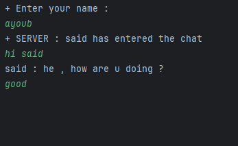

# Java Multi-Client Chat Application

This is a multi-client chat application built using **Java Sockets**. The server allows multiple clients to connect and exchange messages in real time using multi-threading.

## Features
- Supports multiple clients concurrently.  
- Uses **Java Sockets** for client-server communication.  
- Server broadcasts messages to all connected clients.  
- Each client runs on a separate thread using `Runnable`.  
- Simple console-based chat interface.  

## Technologies Used
- **Java**
- **Sockets (`Socket`, `ServerSocket`)**
- **Multi-threading (`Runnable`)**

## Screenshots

 

 
